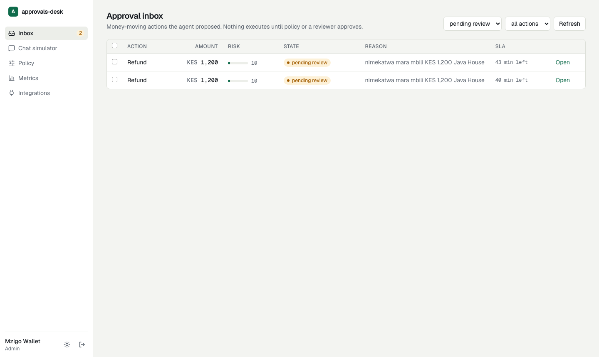
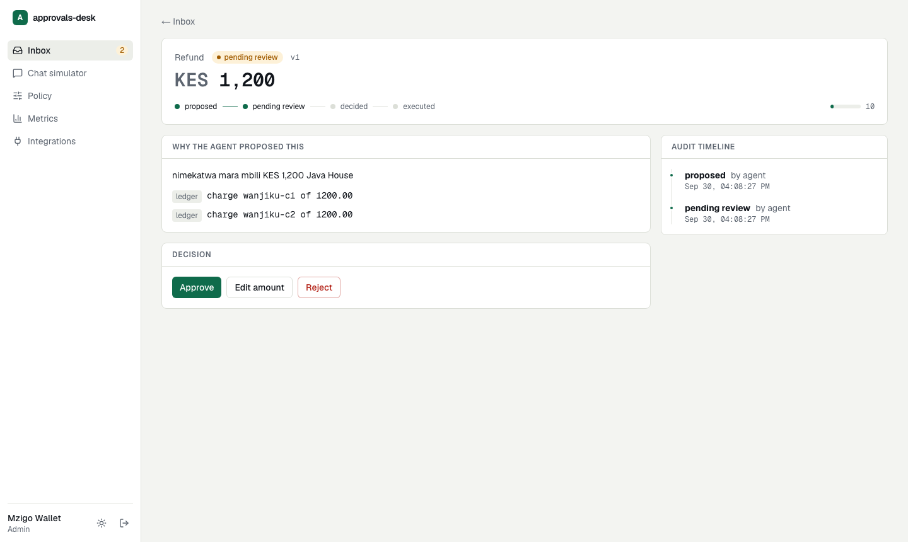
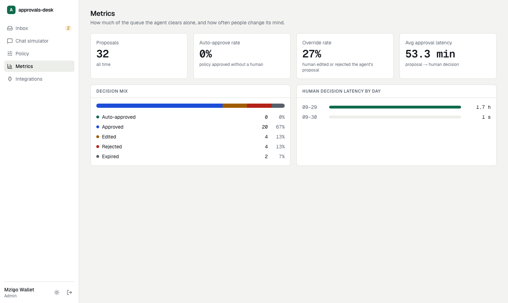

# approvals-desk

A durable, multi-tenant human-in-the-loop console for agent-proposed money movements (refunds, reversals, fee
waivers). A support agent (LLM) **proposes**; policy or a human **decides**; exactly one side effect executes.

The hard parts are the point: exactly-once execution, an enforced approval state machine, tenant isolation in the
database, an append-only audit trail, and runs that survive process kills.

```
customer msg ─▶ API ─▶ LangGraph run ─ classify ─▶ retrieve ctx ─▶ draft proposal ─▶ policy check
                                                                                        │
                       ┌── auto-approve ────────────────────────────────────────────────┤
                       │                              review ─▶ interrupt() (checkpoint in Postgres)
                       │                                          │  human approve / edit / reject
                       ▼                                          ▼
              execute_action  ◀── resume job (arq, Redis) ── API commits state transition first
   (ONE side effect, Idempotency-Key = sha256(thread:proposal:version))
                       │
                       ▼
                 compose reply        every transition ─▶ audit_events (append-only) + outbox ─▶ signed webhooks
```

## The console





## Run it

```bash
docker compose up -d --build          # postgres, redis, jaeger, sandbox, migrate, api, worker
docker compose exec api python -m app.seed
cd web && npm ci && API_URL=http://localhost:8000 npm run dev    # http://localhost:3000
```

Sign in at `/login` (dev issuer, enabled only by `AD_DEV_AUTH=true`): pick a tenant and a role
(`agent` creates tickets, `reviewer` decides, `admin` edits policy).
Jaeger: http://localhost:16686 · Sandbox ledger:
`curl -H 'X-Sandbox-Key: compose-dev-sandbox-key-0123456789' localhost:8001/ledger`

## 60-second demo

1. **/chat** as *agent*: send `nimekatwa mara mbili KES 1,200 Java House` (Sheng-flavoured "I was charged twice").
   The agent drafts a KES 1,200 refund citing both ledger charges; it lands in the inbox as *pending review*.
2. Kill the worker live: `docker compose kill worker`.
3. **Inbox** as *reviewer*: open the proposal, click **Approve**. The state becomes `approved` but nothing has
   executed: the ledger (curl above) still shows no new refund.
4. `docker compose start worker`. The queued resume job runs; the proposal becomes `executed`.
   The ledger shows **exactly one** refund.
5. Open the proposal's **audit timeline** and follow a `trace ↗` link: one Jaeger trace spans
   `approvals-api → approvals-worker → pesa-sandbox`.

Harder version (also verified): `docker compose pause sandbox`, approve, `docker compose kill worker`,
`docker compose unpause sandbox`, `docker compose start worker`. The killed worker's in-flight refund still lands,
the restarted worker replays it with the same idempotency key, and the ledger still has one entry.

## What is guaranteed, and where it is proven

| Property | Mechanism | Proof |
|---|---|---|
| Exactly-once side effect | Own graph node + idempotency key; sandbox stores key → result | `tests/integration/test_chaos.py` (kill after the sandbox accepted the refund, before it was recorded), the compose demo above |
| Legal transitions only | Table-driven state machine in one module; invalid → HTTP 409 | Hypothesis stateful test; concurrent-approval test (4 requests → 1×200, 3×409, 1 refund) |
| Tenant isolation | Postgres RLS (`ENABLE`+`FORCE`), runtime role `NOBYPASSRLS`, fail-closed when unset | `test_rls.py` on real Postgres: cross-tenant read/write blocked |
| Auditability | `audit_events` append-only (revoked + trigger), before/after + `trace_id`, same txn as the change | RLS test; API flow asserts event order |
| At-least-once webhooks | Transactional outbox, `SKIP LOCKED`, HMAC signature, `X-Event-Id` for dedupe | `test_worker_and_concurrency.py` |
| SLA expiry | Worker expires stale `pending_review`, never executes, late approve → 409 | same file |
| Durable resume | LangGraph Postgres checkpointer + worker startup recovery | chaos test, compose demo |
| RBAC + JWT | agent / reviewer / admin; JWTs require `exp`; RS256 via JWKS in prod | `tests/unit/test_auth.py`, Playwright role tests |
| Slack approvals are not a back door | Signed requests (5-min window), Slack user must be mapped to a role, same domain path as the console, escaped text, Slack-only URLs | `test_slack.py`, `test_slack.py` unit (Slack's own signature vector), Playwright signed-click test against the live stack |
| Compensation happens once | Deterministic idempotency key, provider call outside the DB txn, provider refuses a second undo of the same transaction | `test_worker_and_concurrency.py` (lost response then retry, 4-way concurrency), sandbox tests, Playwright |
| Migrations match the models | `alembic upgrade head` on a fresh cluster: schema, forced RLS on every tenant table, audit trigger, role, downgrade round trip | `test_migrations.py` |

Replay semantics (what re-runs on resume) are documented in `docs/adr/0001` and `0003`.

## Tests, evals, CI

```bash
cd backend && uv run ruff check app tests evals && uv run mypy --strict app && uv run pytest -q   # 153 tests, testcontainers
cd backend && uv run python -m evals.run --provider anthropic --model anthropic/claude-haiku-4.5 --mode replay
cd sandbox && uv run pytest -q
cd web && npx tsc --noEmit && npx eslint . && npx playwright test   # needs the compose stack up + seeded
```

- **Evals** (`backend/evals`, `evals/README.md`): 60 tuned + 29 held-out labelled tickets (English/Swahili/Sheng,
  injection attempts, policy boundaries) scored on the *proposal*, not the reply. Gates: accuracy >= 0.8,
  **policy violations = 0**. CI replays recorded Claude Haiku 4.5 outputs: no key, no cost.
  **The held-out set failed the gates on first run** (0.793 accuracy, 0.103 violations) because auto-approval
  trusted the model's risk score; auto-approval is now decided by code (`docs/adr/0005`). Post-fix 0.862 / 0.0 is not
  an unbiased estimate.
- **CI** (`.github/workflows/ci.yml`): ruff, mypy --strict, pytest, evals, eslint, tsc, build, Playwright against
  the compose stack, Docker builds, Trivy (HIGH/CRITICAL). All six jobs pass on GitHub-hosted runners (the first run
  caught a nonexistent Trivy action tag and, earlier, a `tsc` failure that only appeared on a clean checkout).

## Live deployment

Web on Vercel (`https://approvals-desk.vercel.app`) with GitHub sign-in restricted to an allowlist; backend on Railway
(API, worker, sandbox, Postgres, Redis). It is a **demo**: fake payments sandbox, rule-based stand-in for the LLM.
Architecture, variables, and operations: [`docs/deploy.md`](docs/deploy.md).

## Infrastructure

`infra/` is Terraform for AWS: VPC, RDS Postgres 16 (Multi-AZ, encrypted), ElastiCache Redis, ECS Fargate
(api behind an ALB, worker, sandbox via Cloud Map), ECR, Secrets Manager. `terraform validate` passes;
**it has never been planned or applied** (no AWS account was used). Run the `migrate` task definition before each
deploy. The frontend is meant for Vercel with `API_URL` pointing at the ALB.

A checkov pass is clean apart from documented exceptions in `infra/.checkov.yaml` (customer-managed KMS keys, secret
rotation, WAF, ALB access logs). HTTPS is mandatory (`certificate_arn` is required), Redis uses TLS with an auth token,
and there is one NAT per AZ by default. Known gaps: the Pesa Sandbox is a fake (shared-key auth only) and shares the RDS
instance; the S3 state backend is declared but you must supply its `-backend-config`.

### First-time AWS setup

No AWS account yet? Create one, then sign in with IAM Identity Center (`aws configure sso && aws sso login`), never root keys.
After that, one command does the rest:

```bash
infra/scripts/setup.sh
```

It checks your tools and credentials, creates the state bucket, lock table and a GitHub OIDC role (CI holds no AWS
keys; it sets the `AWS_ROLE_ARN` secret for you), writes `backend.hcl` and `terraform.tfvars` (both gitignored),
pushes the images to ECR, and shows a plan. Nothing billable is created until you type `yes` twice. CI runs
`terraform fmt`/`validate` on every push.

## Decisions

`docs/adr/`: checkpointer vs Temporal, RLS vs schema-per-tenant, single-side-effect execute node, outbox and arq,
auto-approval decided by code, Slack approvals and compensation.

## Slack setup

1. Create a Slack app with an **Incoming Webhook** (pick the channel) and **Interactivity** enabled; set the
   Interactivity Request URL to `https://<api-host>/integrations/slack/interactions`.
2. Give the API the app's signing secret: `AD_SLACK_SIGNING_SECRET` (Terraform: `slack_signing_secret`) and
   `AD_CONSOLE_URL` for the "Open / edit" link. Without the secret the endpoint answers 503 and messages still post.
3. In the console, **Integrations** (admin): paste the webhook URL, send a test message, then map each Slack user id
   that may decide (reviewer or admin). Unmapped users' clicks are refused and audited.

Edits stay in the console (the message links there). The approve button asks for confirmation.

## Compensation

An admin can undo an `executed` payout from the proposal page (reason required, once only, audited): the customer is
debited again through the provider's idempotent compensation endpoint, and the proposal becomes `compensated`.

## Scope

One channel (chat simulator) plus Slack approvals, three action types, one LLM provider. Not built: a WhatsApp
channel, email approvals, reconciliation against a provider ledger, a real payments provider (Pesa Sandbox is a fake).
